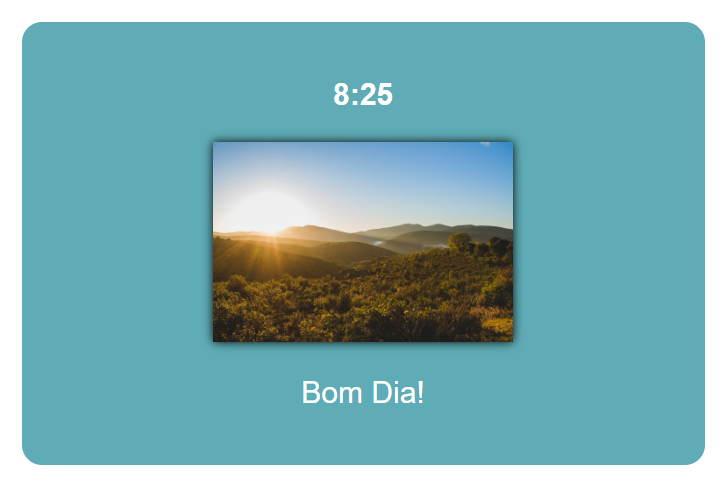
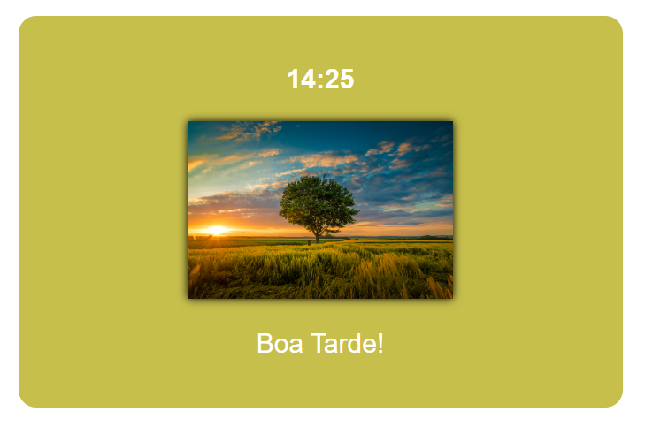
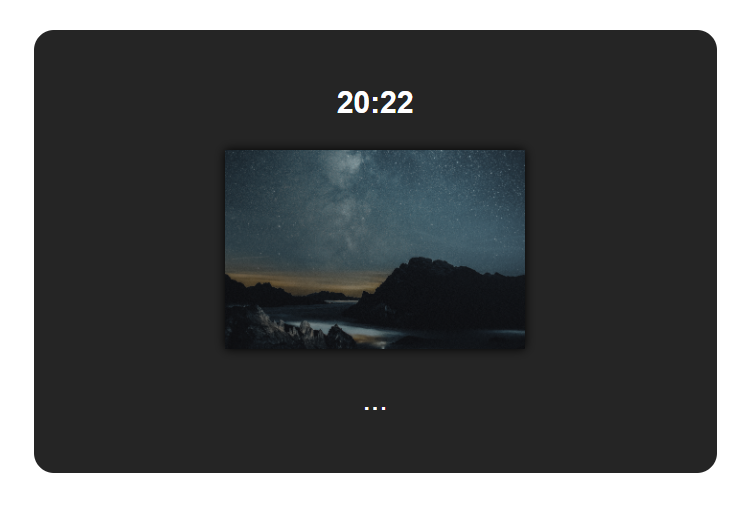

# manha-tarde-noite

    
    
    

 

Este projeto é uma aplicação simples em JavaScript que utiliza o objeto <strong><i>new Date()</i></strong> para identificar a hora atual do sistema e, com base nisso, exibir uma saudação personalizada (bom dia, boa tarde ou boa noite).

## Funcionalidades:

- Manhã: Se a hora estiver entre 6h e 12h, o sistema considera como manhã.

- Tarde: Entre 12h e 18h, o período é identificado como tarde.

- Noite: Para qualquer outro horário (antes de 6h ou após 18h), é considerado noite.

## Interação:
Cada período do dia exibe uma imagem diferente:

Ao clicar na imagem correspondente, uma mensagem é exibida:

- <strong>"Bom dia"</strong> para o período da manhã.
- <strong>"Boa tarde"</strong> para o período da tarde.
- <strong>"Boa noite"</strong> para o período da noite.

Sinta-se à vontade para explorar o código e contribuir com melhorias!

 
